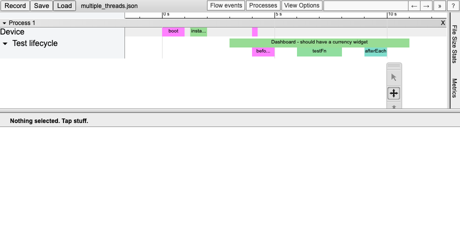

# trace-event-lib

A library to create a trace of your JS app per [Google's Trace Event format](https://docs.google.com/document/d/1CvAClvFfyA5R-PhYUmn5OOQtYMH4h6I0nSsKchNAySU).



These logs can then be visualized with:

* <chrome://tracing> (see the [archive](https://github.com/catapult-project/catapult/tree/master/tracing))
* [Perfetto](https://ui.perfetto.dev) – doesn't support async events, as of 29.06.2022.

# Install

```shell
npm install trace-event-lib --save
````

# Usage

```javascript
import { AbstractEventBuilder } from 'chrome-trace-event';

class ConcreteEventBuilder extends AbstractEventBuilder {
    send(event) {
        // write your event into a stream, array, etc...
    }
}

const trace = new ConcreteEventBuilder();

trace.begin({ cat: 'category1', name: 'event name' });
// ... do something ...
trace.end();

const handle = trace.begin({ cat: 'network', name: 'send request', tid: 2 });
// ... do something ...
handle.end({ args: { /* response */ } });

// See also:
//
// * trace.instant
// * trace.complete
// * trace.beginAsync
// * trace.instantAsync
// * trace.endAsync
// * trace.counter
// * trace.metadata
// * trace.process_name
// * trace.process_labels
// * trace.process_sort_index
// * trace.thread_name
// * trace.thread_sort_index
```

# Links

* https://github.com/google/trace-viewer/wiki
* https://docs.google.com/document/d/1CvAClvFfyA5R-PhYUmn5OOQtYMH4h6I0nSsKchNAySU

# License

[MIT License](LICENSE)
